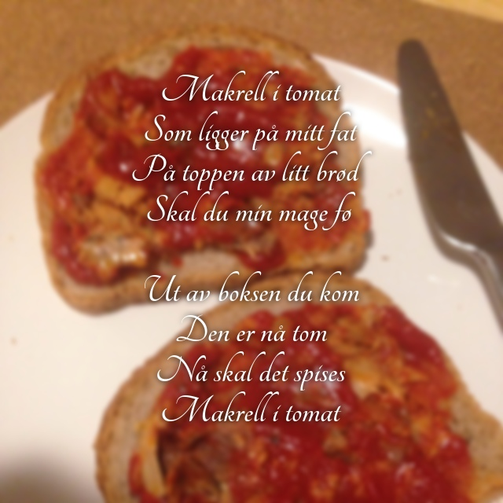
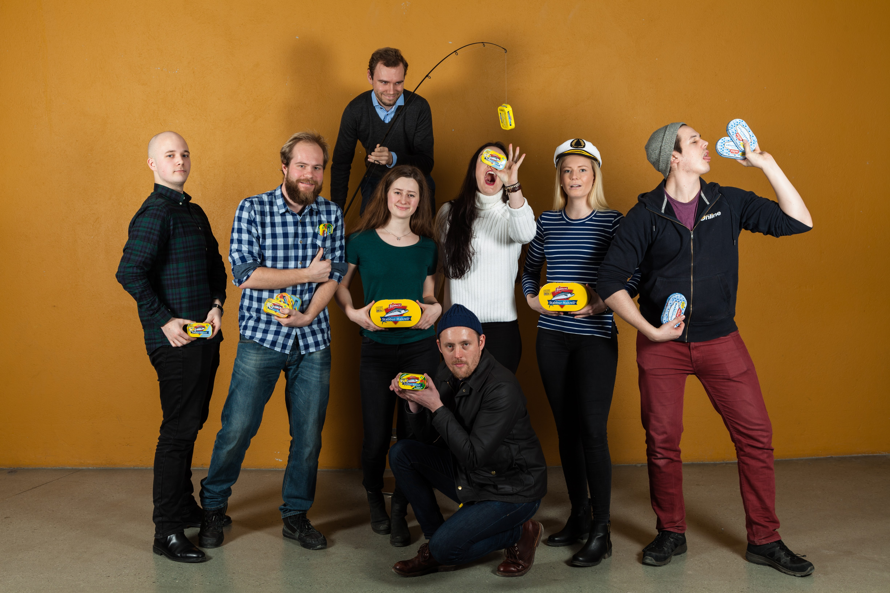

I 1958 gikk Svein Jervel og Gunnar Nilsen sammen om et prosjekt som skulle forandre verden. Hva om vi kombinerte den edle makrellen med den eksotiske tomaten? Med Stabburet i spissen kom produktet vi alle kjenner som Makrell i Tomat til livet. Siden den gang har dette vært et av de mest populære påleggene i Norge, og har gjentatte ganger blitt kåret til Norges sunneste pålegg. 

Selv om gruppens navn lener såvidt mot ett av de mange kjønnene som eksisterer der ute, ønsker vi alle velkommen med åpne armer.  

Nåværende medlemmer
---------------------------------

Under er en liste over de medlemmene gruppa har.

    Vår hymn

- **Leder:** Ellen Bakksjø
- **Tidligere Leder:** Marius Thingwall
- **Nestleder:** Fredrik "Rulle-fred" B. Tørnvall
- **Fiskeriminister:** Kristoffer Andreas Breiland "Fishboy" Dalby
- **Tomatminister:** Andrea Nornes
- **Agile Webscale-ansvarlig:** Anders "Mini-myth" Larsen
- **Moder Makrell:** Margit Schefte
- **Matros:** Signe Elise Livgard
- **Nordnorsk Ambassadør:** Sigurd Wie
- **Økonomiansvarlig:** Katrine Jordheim
- **Tilbudsansvarlig:** Johan N. Slettevold
- **Trivselsansvarlig:** Ellen Bakksjø
- **Propagandaminister:** Ivar "Flakken Flaksnes" Flakstad
- **Drift og utviklingsansvarlig:** Christian Duvholt
- **Samferdselsminister:** Jarle "Hvor bor jeg" Trollebø
      
  
  
  
  
  
     

Retningslinjer
--------------

### §1 Gruppens formål

Samle og forene linjeforeningens medlemmer og spise lunsj på kontoret,
samt fremme sunne pålegg.

### §2 Gruppens eksistens
Så lenge det finnes informatikere som ønsker å samles for å spise lunsj,
vil gruppen eksistere.  Lunsjerne bør etterstrebe å nyte Makrell i Tomat. 

### §3 Gruppens navn

Gruppens omtales over alle kanaler som "Makrellgutta".

### §4 Gruppens sammensetning

Leder  
Nestleder  
Fiskeriminister  
Tomatminister  
Resten  
  
Historie
--------
  Makrellgutta anno 16/17
