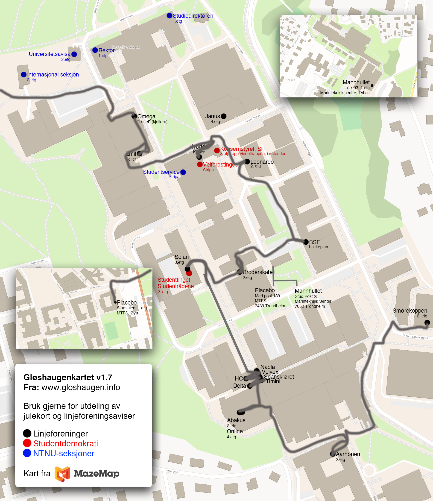

### Velkommen til **www.gloshaugen.info**

Tilhørende info

* Kontakte linjeforeningene? [Se epostlister her](https://online.ntnu.no/resourcecenter/mailinglists)
* Er din linjeforening listet opp her? Send epost til kontakt@online.ntnu.no for oppdateringer
* Har dere kontor? [Les regler for rombruk og internhusleie](https://innsida.ntnu.no/web/guest/wiki/-/wiki/Norsk/Regler+for+bruk+av+arealer)
* Trenger dere kontor? [Søk til NTNU sentralt om fristasjon for studentorganisasjon](https://innsida.ntnu.no/web/guest/wiki/-/wiki/Norsk/Lokaler+for+studentorganisasjoner+og+studentforeninger)
* Merk at linjeforeninger og andre fakultetsspesifikke stud.org.er får areal dekket av sitt fakultet v/fakultetsdirektør

Tilhørende wikisider

*  Du er her: [Linjeforeninger på Gløshaugen, Øya, Tyholt](/info/sosialt-og-okonomisk/linjeforeninger/)
* [Linjeforeninger på Dragvoll](/info/sosialt-og-okonomisk/linjeforeninger/dragvoll/)
* [Linjeforeninger på Kalvskinnet](/info/sosialt-og-okonomisk/linjeforeninger/kalvskinnet/)
* [Linjeforeninger på Tunga](/info/sosialt-og-okonomisk/linjeforeninger/linjeforeninger-pa-tunga/)
* [Linjeforeninger i Ålesund](/info/sosialt-og-okonomisk/linjeforeninger/alesund/)
* [Linjeforeninger på Gjøvik](/info/sosialt-og-okonomisk/linjeforeninger/gjovik/)
* [Andre linjeforeninger ved NTNU](/info/sosialt-og-okonomisk/linjeforeninger/andre/)
* [Studentkjellere på Moholt](/info/sosialt-og-okonomisk/linjeforeninger/studentkjellere/)
* [Karrieredager](/info/sosialt-og-okonomisk/linjeforeninger/karrieredager/)
* [International student organizations at NTNU](/info/sosialt-og-okonomisk/linjeforeninger/internasjonalorg/)

## Linjeforeninger

Linjeforeningene på Gløshaugen er de mest kjente linjeforeningene i
Norge. De har årelange tradisjoner og noen av dem er eldre enn hundre
år. For å unngå å overlesse listen har vi valgt å sette et par kriterier
for hva som definerer en linjeforening: Linjeforeningen må ha fadderuker
og må være åpen for studenter gjennom et fullt studieløp på fem år.

|Linjeforening|BrReg|Linje|Kjennetegn ved styremedlemmer|Kontor|Avis|Facebook|Boksalg|
|---|---|---|---|---|---|---|---|
| [Abakus](http://abakus.no) (1977) | [BrReg](http://w2.brreg.no/enhet/sok/detalj.jsp?orgnr=986037314) | Data og KomTek | Styrebånd (rød med svart stripe) | [RFB A3-133](https://s.mazemap.com/2LdeKcM) | [readme](http://readme.abakus.no) | [Page](http://fb.com/AbakusNTNU) | |
| [A/F Smørekoppen](http://www.smorekoppen.no) (1929) | [BrReg](http://w2.brreg.no/enhet/sok/detalj.jsp?orgnr=991056009) | Produktutvikling og Produksjon | Styrebånd (rød med gullkant) | [Verkstedteknisk 2. etg](https://link.mazemap.com/vBBn8IYX) | M-ord | [Page](http://fb.com/smorekoppen/) | |
| [Arkitektstudentenes Broderskab](http://broderskabet.no/) (1913) | [BrReg](http://w2.brreg.no/enhet/sok/detalj.jsp?orgnr=991596089) | Arkitekt | Styrebånd (gul ytterst, svart innover, lilla stripe i midten) | [Sentralbygg 1](http://use.mazemap.com/#&v=1&dest=5187&desttype=poi) | [A](http://tidsskrifteta.no/) | [Page](http://fb.com/arkitektstudentenesbroderskab) | |
| [BSF](http://bergstud.no) (1914) | [BrReg](http://w2.brreg.no/enhet/sok/detalj.jsp?orgnr=993555738) | Geologi, TekGeo, PetTek og MatTek | Bergmannsdrakten | [PTS, 116](https://link.mazemap.com/UlxwZIng) | Bergmanden | [Page](http://fb.com/bergstud), [Person](http://fb.com/bergstuderendes.forening) | [Boksalg](http://fb.com/groups/369041746482558/) |
| [De Høylegerte](http://www.dehoylegerte.no/) (2000) |  | Materialteknologi |  | Berg |  | [Page](https://www.facebook.com/dehoylegerte/) | |
| [Delta](http://www.deltahouse.no) (1974) | [BrReg](http://w2.brreg.no/enhet/sok/detalj.jsp?orgnr=996510352) | Matte, Fysikk, Statistikk | Styrebånd (grønn/sølv med sølvstripe i midten) | [Kjemi sydfløy](http://use.mazemap.com/#&v=1&dest=7591&desttype=poi) | [Δt](http://www.deltahouse.no/avis) | [Page](http://fb.com/DeltaNTNU) | [Boksalg](http://fb.com/groups/1683020211913714/) |
|[Elektra](https://www.elektra.io)(2007)|[BrReg](https://w2.brreg.no/enhet/sok/detalj.jsp?orgnr=991107711)| Elektroingeniør (bachelor) | Styrebånd (grønn/marinblått) | [Tapirbygget](https://use.mazemap.com/#v=1&zlevel=4&left=10.4047848&right=10.4064160&top=63.4183039&bottom=63.4179636&campusid=1&sharepoitype=poi&sharepoi=6228) |  | [Page](https://www.facebook.com/elektraNTNU/) | |
| [Emil](http://emilntnu.no) (1998) | [BrReg](http://w2.brreg.no/enhet/sok/detalj.jsp?orgnr=991212736) | Energi og miljø | Styrebånd (grønn med gullkant), hatt | [Gamle elektro](http://use.mazemap.com/#&v=1&dest=103&desttype=poi) | Vannmagasinet | [Page](http://fb.com/emilface) | |
| [HC](http://www.chemie.no) (1915) | [BrReg](http://w2.brreg.no/enhet/sok/detalj.jsp?orgnr=990833761) | IndKjemi og BioTek | Styrebånd (gul/sort) | [Kjemi sydfløy](http://use.mazemap.com/#&v=1&dest=7588&desttype=poi) | Sugepumpen | [Page](http://fb.com/HoiskolensChemikerforening) | [Boksalg](https://www.facebook.com/groups/420596124675473/about/) |
| [H.M. Aarhønen](http://aarhonen.no) (1913) | [BrReg](http://w2.brreg.no/enhet/sok/detalj.jsp?orgnr=890497292) | Bygg | Styrebånd (lilla/hvit/grønn) | [Byggteknisk](https://link.mazemap.com/gtZtu7dC) | Spikers Kårner | [Page](http://fb.com/Aarhonen) | |
| [Intro](http://introntnu.no) (2021) | [BrReg](http://w2.brreg.no/enhet/sok/detalj.jsp?orgnr=927292920) | Forkurs for ingeniør- og sivilingeniørutdanning | Styrebånd (oransje/marineblått/blått) |  |  | [Page](http://fb.com/IntroNTNU) |  |
| [Hybrida](http://hybrida.no) (2003) | [BrReg](http://w2.brreg.no/enhet/sok/detalj.jsp?orgnr=992407263) | IngVit og IKT | Styrebånd (rutete grønn/blå), kilt | [1-230 Byggteknisk](https://link.mazemap.com/D2UGm1BQ) | [Update^k](http://www.hybrida.ntnu.no/hybridaweb/Hybrida/Internavis/) | [Page](http://fb.com/hybrida) | [Boksalg](http://fb.com/groups/285067151615782/) |
| [Janus](http://januslinjeforening.no) (1986) | [BrReg](http://w2.brreg.no/enhet/sok/detalj.jsp?orgnr=992305126) | Indøk | Styrebånd (marineblått/hvitt, burgunderrødt bånd for tidligere medlemmer), styredaljer | [Kjelhuset](http://use.mazemap.com/#&v=1&dest=34697&desttype=poi) | JanuScript | [Page](http://fb.com/januslinjeforening) | [Boksalg](http://fb.com/groups/126833490754473/) |
| [Leonardo](http://industrielldesign.no) (1994) | [BrReg](http://w2.brreg.no/enhet/sok/detalj.jsp?orgnr=992459425) | Industriell design | Styrebånd (hvite) | [Institutt for (produkt)Design](http://use.mazemap.com/#&v=1&dest=35936&desttype=poi) | The Sign | [Page](http://fb.com/LeonardoLinjeforening), [Person](http://fb.com/leonardo.linjeforening.7), [Group](http://fb.com/groups/142627265775491/) | |
| [Logitas](http://www.logitas.no/) (1989) | [BrReg](https://w2.brreg.no/enhet/sok/detalj.jsp?orgnr=891131372) | Logistikkingeniør | Styrebånd (Gult med rød stripe) | [Gemba](https://link.mazemap.com/EigLnAdY) |  | [Page](https://www.facebook.com/profile.php?id=100064073106026) | |
| [Mannhullet](http://mannhullet.no) (1917) | [BrReg](http://w2.brreg.no/enhet/sok/detalj.jsp?orgnr=991538836) | Marin teknikk | Styrebånd (mørkeblå), NTH-medaljer | Marinteknisk senter, a1.003 | Marina | [Page](http://fb.com/pages/Mannhullet/161454280549602/)| [Boksalg](http://fb.com/groups/245012782293185/) |
| [MiT](https:/www.maskining.no/) | [BrReg](http://w2.brreg.no/enhet/sok/detalj.jsp?orgnr=992376430) | Maskin | Syrebånd (blå med oransje stripe) | [VE23](https://link.mazemap.com/dNwgWu2g) |  leder@maskining.no | [Page](https://www.facebook.com/Maskiningeni%C3%B8r-i-Trondheim-47566809492) |
| [Nabla](http://nabla.no) (1943) | [BrReg](http://w2.brreg.no/enhet/sok/detalj.jsp?orgnr=992168544) | FysMat | Styrebånd (blå med gullkant) | [Kjemi sydfløy](http://use.mazemap.com/#&v=1&dest=7594&desttype=poi) | [Nabladet](http://nabla.no/nabladet/) | [Group](http://fb.com/groups/2248934869/) | [Boksalg](http://fb.com/groups/274516045996844/) |
| [Nutrix](http://nutrix.no) (2011) | [BrReg](http://w2.brreg.no/enhet/sok/detalj.jsp?orgnr=999094872) | Sykepleier | Styrebånd (hvit/lyseblå)| | post@nutrix.no | [Page](http://fb.com/pages/Nutrix/297838347011022) 
| [Omega](http://omega.ntnu.no) (1919) | [BrReg](http://w2.brreg.no/enhet/sok/detalj.jsp?orgnr=890384692) | ElSys og Kyb | Styrebånd (hvit/sort) | [Gamle elektro](https://link.mazemap.com/tKXG2Ncn) | [OmBul](http://omega.ntnu.no/ombul/) | [Page](http://fb.com/SctOmegaBroderskab), [Group](http://fb.com/groups/omega.ntnu/) |[Boksalg](https://www.facebook.com/groups/826883277342963/) |
| [Online](https://online.ntnu.no) (1985) | [BrReg](http://w2.brreg.no/enhet/sok/detalj.jsp?orgnr=992548045) | Informatikk | Styrebånd (hvit, oransj og mørkeblå) | [RFB A4-137](http://bit.ly/2Ji5Vg2) | [Offline](http://online.ntnu.no/offline) | [Page](http://fb.com/LinjeforeningenOnline) | |
| [Placebo](http://mfplacebo.no) (1976) | [BrReg](http://w2.brreg.no/enhet/sok/detalj.jsp?orgnr=991025456) | Medisin | Styrebånd, sløyfer (rød/hvit) | [MTFS, Studsalen](http://use.mazemap.com/?&v=1&campusid=3&desttype=poi&dest=64826) | [Nocebo](http://mfplacebo.no/hjem/nocebo/) | [Page](http://fb.com/pages/MF-Placebo/132226684043)| |
| [Signifikant](http://org.ntnu.no/signifikant) |  | Forsker (medisin) | Styrebånd (hvitt og kongeblått) |  |  |  [Group](http://fb.com/groups/2735131351/) |  |
| [Spanskrøret](https://spanskroret.no) (2004) | [BrReg](http://w2.brreg.no/enhet/sok/detalj.jsp?orgnr=988621625) | RealfagsLektor | Styrebånd (grågrønt med sølvkant over hvitt), spanskrør | [Kjemi sydfløy](http://s.mazemap.com/1fH68BL) | [Vitnemålet](https://spanskroret.no/vitnemal/) | [Page](http://fb.com/Spanskroret), [Group](http://fb.com/groups/2247443234) | [Boksalg](http://fb.com/groups/143817362375932/) |
| [Timini](http://timini.no) (2006) | [BrReg](http://w2.brreg.no/enhet/sok/detalj.jsp?orgnr=990373418) | NanoTek | Styrebånd (tynne turkise med sølvlenke) | [Kjemi sydfløy](http://use.mazemap.com/#&v=1&dest=7596&desttype=poi) | inTimini | [Page](http://fb.com/TiminiNTNU) | |
| [Vivas](http://teknikersamfunn.no/vivas/) (2012) | [BrReg](https://w2.brreg.no/enhet/sok/detalj.jsp?orgnr=898893952) | Fornybar energi | Styrebånd (blå med hvit stripe) | [Strømningsteknisk](https://use.mazemap.com/#v=1&zlevel=-1&campusid=1&campuses=ntnu&left=10.4038033&right=10.4063782&top=63.4187048&bottom=63.4181419&sharepoitype=poi&sharepoi=35602) |  | [Page](https://www.facebook.com/VivasNTNU/) | |
| [Volvox & Alkymisten](http://volvox.no) (1961) | [BrReg](http://w2.brreg.no/enhet/sok/detalj.jsp?orgnr=992357002) | Kjemi, Biologi, BioTek | Styrebånd (grønn med gullkant) | [Kjemi sydfløy](http://use.mazemap.com/#&v=1&dest=7594&desttype=poi) | Nukleotidende | [Page](http://fb.com/volvoxogalkymisten) | [Boksalg](http://fb.com/groups/462966773725320) |
| [Fraktur](http://www.facebook.com/frakturno/) (2009) | [BrReg](https://w2.brreg.no/enhet/sok/detalj.jsp?orgnr=993803367) | Radiograf | | [MTFS, Grupperom 5](https://use.mazemap.com/#v=1&left=10.3917226&right=10.3942717&top=63.4207009&bottom=63.4201401&zlevel=2&sharepoitype=poi&sharepoi=70828&campusid=3) | | [Page](http://www.facebook.com/frakturno/) | |
| [TIHLDE](http://www.tihlde.org) (1993) | [BrReg](http://w2.brreg.no/enhet/sok/detalj.jsp?orgnr=989684183) | Dataingeniør, Digital Forretningsutvikling, Digital Infrastruktur og Cybersikkerhet, og Digital Samhandling | Styrebånd (blå med sølvkant) | [A3-116](https://use.mazemap.com/#v=1&zlevel=3&center=10.404638,63.415431&zoom=20.1&campusid=1&sharepoitype=poi&sharepoi=72902&utm_medium=longurl) | hs@tihlde.org | [Page](https://www.facebook.com/tihlde/), [Group](https://www.facebook.com/groups/507122389791558/) | Tøddel
| Antidot (2020) |  | Farmasi |  |  | antidot.ntnu@gmail.com | | 
| Ægir (2020) | [Brreg](https://w2.brreg.no/enhet/sok/detalj.jsp?orgnr=925625396) | Havbruksingeniør | Maringrønn med lyseblåstripe i midten | [NV-gangen](https://link.mazemap.com/d7gTvFxU) | [styret@aegirntnu.no](mailto:styret@aegirntnu.no) | [Page](https://www.facebook.com/aegirntnu) |
| [Tim&Shænko](http://www.bygging.no/) (1999) | [Brreg](https://w2.brreg.no/enhet/sok/detalj.jsp?orgnr=991494952) | Bygg og Miljø | Blått med hvit stripe | [Byggteknisk](https://link.mazemap.com/RFPdeFxz) | | [Facebook](https://www.facebook.com/Timogshaenko/?ref=pages_you_manage) | 
| [Pareto](http://pareto-ntnu.no) (1993) | [Brreg](https://w2.brreg.no/enhet/sok/detalj.jsp?orgnr=912807177) | Samfunnsøkonomi | Mørkeblått med hvit stripe | [Handels](https://link.mazemap.com/ikjGxAGW) | pareto.linjeforening@gmail.com | [Page](https://www.facebook.com/paretolinjeforening/), [Person](http://fb.com/vilfredo.pareto.370), [Group](http://fb.com/groups/2249582621/) |
| Nucleus (2009) | [Brreg](https://w2.brreg.no/enhet/sok/detalj.jsp?orgnr=994544306) | Bioingeniør | Mørk og lys lilla | [Laboratoriesenteret](https://link.mazemap.com/ewKejhmU ) | nucleuslinjeforening@gmail.com | [Page](https://www.facebook.com/nucleuslinjeforening) | |
| [STØH](http://www.sftoh.no) (1967) | [Brreg](https://w2.brreg.no/enhet/sok/detalj.jsp?orgnr=990542791) | Studentforeningen for Handelshøyskolen | lyseblått og mørkeblått | [Adolf Øiens bygg](https://link.mazemap.com/Wiz9OvNy) | Rustblekka | |

## Masterforeninger

|Masterforening|BrReg|Linje|Kjennetegn ved styremedlemmer|Facebook|Avis|Kontor|
|---|---|---|---|---|---|---|
|[BioM](http://org.ntnu.no/biom)||Biologi||[Page](http://fb.com/pages/BioM/211739618885287)|||
|Bunnsolid|[BrReg](https://w2.brreg.no/enhet/sok/detalj.jsp?orgnr=814470172)|Undervannsteknologi|||||
|NJORD|[BrReg](http://w2.brreg.no/enhet/sok/detalj.jsp?orgnr=992378794)|MSc Ocean Resources||[Page](https://www.facebook.com/NjordNTNU/), [Group](http://fb.com/groups/2260532937/)||Brattørkaia 17c, 7010 Trondheim|
|[Hippodamus](http://hippodamus.no/)|[BrReg](http://w2.brreg.no/enhet/sok/detalj.jsp?orgnr=998244854)|Master i Eiendomsutvikling og - Forvaltning, Master i Fysisk Planlegging||[Group](http://fb.com/groups/161226483916509/)|[HippoDaily](http://hippodamus.no/tidligere-hippodailies-2)||
| Poka-Yoke | [BrReg](https://w2.brreg.no/enhet/sok/detalj.jsp?orgnr=997640756) | Master i helse, miljø og sikkerhet || [Page](https://www.facebook.com/pokayokeNTNU/) | | ||
|Projeksjon (også for 3. klasse)|[BrReg](http://w2.brreg.no/enhet/sok/detalj.jsp?orgnr=995453231)|Geomatikk||[Page](http://fb.com/pages/Geomatikklesesalen/168410799862032)|||
|[ProMan](http://www.mscproman.com/) (est. 2010)|[BrReg](https://w2.brreg.no/enhet/sok/detalj.jsp?orgnr=996617556)|Project management|Styrebånd (vinrødt med kremfarget kant)|[Group](https://www.facebook.com/groups/MScProMan/)||Rom 346, Sentralbygg 2|
|[Solan](https://www.solanlinjeforening.no)|[BrReg](http://w2.brreg.no/enhet/sok/detalj.jsp?orgnr=992029471)|[NTNUs Entreprenørskole](http://www.entreprenorskolen.no)||[Page](https://www.facebook.com/solanlinjeforening/)||Oppredning/gruvedrift, 4.egt, Rom 453|
|[Symbiosis](http://www.ntnusymbiosis.com)|[BrReg](http://w2.brreg.no/enhet/sok/detalj.jsp?orgnr=994052012)|Industriell Økologi||[Group](http://fb.com/groups/104245099606755/)|||
|[GLOBUS](https://www.ntnu.edu/studies/msgloman) ||Global Produksjonsledelse||[Page](https://www.ntnu.edu/studies/msgloman), [Linkedin](https://www.linkedin.com/company/globus-ntnu)||209 på verkstedtekniske laboratorier|
| [SOMA](https://www.soma-linjeforening.com) | [Brreg](https://w2.brreg.no/enhet/sok/detalj.jsp?orgnr=991232559) | Masterstudenter ved Fakultet for Medisin og Helsevitenskap: Folkehelse, Global helse, Helseinformatikk, Jordmorfag, Klinisk helsevitenskap, Klinisk sykepleier, Medisinsk bildeteknologi, Molekylær Medisin, Nevrovitenskap, Fysisk aktivitet og Helse, Helsesykepleie og Psykisk helse | Styregenser | [Facebook](https://www.facebook.com/SOMANTNU) |  | MTFS, Studsalen |

## Doktorgradsforeninger

|Doktorgradsforening|BrReg|Linje|Facebook|
|---|---|---|---|
|[DION](http://www.dion.ntnu.no)||Alle doktorgrader|[Page](http://fb.com/DION.NTNU)|

## Tradisjoner

Tradisjoner som linjeforeninger på Gløshaugen har opprettholdt i mange
år

-   Linjeforeninger på Gløshaugen holder som regel **fadderuker** (to
    uker) i august
-   Linjeforeninger på Gløshaugen holder som regel **immball** i
    september
-   Linjeforeninger på Gløshaugen drar som regel på **Åretur** i januar
-   Linjeforeninger på Gløshaugen drar som regel på **tur til
    Studenterhytta**
-   Linjeforeninger på Gløshaugen holder som regel **jubileum** hvert
    femte år slik at alle 5-årige studenter skal få oppleve et jubileum

Arrangementer der linjeforeningene inviterer hverandre

-   Linjeforeninger på Gløshaugen pleier å **invitere de andre
    linjeforeningsstyrene** til immball, jubileum og andre storfester
-   H.M. Aarhønen holder **byggrevyen** hver vår
-   Emil og Placebo holder **styrefest** hver høst
-   Emil og A/F Smørekoppen lager **revy** hver vår
-   HC lager **musikal** hver vår
-   Omega bulletin holder **presseconfirance** hver vår, en fest for
    linjeredaksjonene
-   A/F Smørekoppen holder **badekarpadling** på Nidelven i september
-   Janus linjeforening lager **Indøkrevyen** hver vår.
-  Nabla lager **Nablarevyen** hvert år.
- Spanskrøret og Timini lager **Naborevyen** hvert år.

## Ressurser

### Søke økonomisk støtte

-   **Kulturstyret**, SiT ved Kulturstyret deler ut 1.000.000 i året
    -   Les mer på [sit.no/forening/støtte-til-foreninger](https://www.sit.no/forening/st%C3%B8tte-til-foreninger)
    -   På høsten tildeles midler til oppstartsprosjekter (ny
        linjeforening, nytt band, ny webside, osv.)
    -   På våren tildeles midler til drift (videreføring, vedlikehold,
        osv.), det er her brorparten av midlene deles ut
-   **Prosjektmidler**, Studenttinget deler ut opptil 45.000 i året til
    nyoppstartede prosjekter
    -   Les mer på [www.studenttinget.no/prosjektmidler](http://www.studenttinget.no/prosjektmidler)
    -   Midlene skal støtte opp under tiltak for å fremme en sak eller
        et tema som den søkende organisasjonen ønsker belyst
    -   Prosjektet må være til gode for en god del studenter på NTNU
-   **Repromidler**, Studenttinget refunderer opptil 50% av
    trykkekostnader dersom man har brukt NTNU Trykk
    -   Les mer på [www.studenttinget.no/repromidler](http://www.studenttinget.no/repromidler)
    -   På høsten er søknadsfristen 1. oktober
    -   På våren er søknadsfristen 1. mars
-   **Støtte til studentfrivilligheten**
    - Krav om at foreningen er en studentforening i tilknytning til NTNU.
    - Krav om at foreningen er registrert som ideell organisasjon med organisasjonsnummer i Brønnøysundregisteret. For foreninger som ikke er registrert i Brønnøysundregisteret settes det et maks tak på tildeling av midler på kr 10.000,-.
    - Støtte innvilges til arrangement som bidrar til sosial integrering av studenter. Støtte innvilges også til aktiviteter det ikke er lagt planer for i budsjettåret. Det er et krav om at arrangementet er rettet mot NTNU studenter.
    - Det kan innvilges kortsiktig støtte til drift.
    - Det stilles krav om levering av organisasjonens regnskap, kontoutskrift, samt budsjett for tiltaket det søkes midler til.
    - Mer informasjon [her](https://i.ntnu.no/wiki/-/wiki/Norsk/%C3%98konomisk+st%C3%B8tte+til+studentfrivilligheten).
-   **Akan**, støtter alkoholfrie arrangementer
    -   Finn søknadsskjemaet for “Midler til rusmiddelforebyggende
        arbeid blant studenter” på [akan.no](http://akan.no)
    -   Send inn skjema og budsjett for aktiviteten det søkes penger for
    -   Legg merke til frist

-   **Velferdstinget** i Gjøvik, Ålesund og Trondheim deler ut 500.000,- i året. 
    -   Formålet med Velferdstingets sponsormidler er å bygge opp 
        under studentfrivillighet og virksomheter i Gjøvik, Ålesund 
        og Trondheim som sikrer langsiktig engasjement. 
    -   Frivillige foreninger/organisasjoner som er åpne for alle 
        studenter med formål om å bidra til positivt studentmiljøet 
        i sin respektive by kan søke.
    -   Mer informasjon kan bli funnet her [vedlegg 523](/attachments/523-Retningslinjer_for_Velferdstingets_sponsormidler.pdf).

-   **Studentrådet IE** deler ut 150 000,- i året til prosjekter som gagner hovedsaklig studenter ved IE fakultetet. 
    -   Mer informasjon kan bli funnet [her](https://ie.studentrad.no/2018/04/26/velferdsmidler/).

### Tjene penger

-   **Bedpres**
    -   Bedriftene vil treffe signeringsklare masterstudenter, dette
        betaler de gjerne for
    -   Få inn bedrift, ta administrasjonsgebyr på f.eks. 3.000 - 15.000
    -   Tilby en kursvariant, litt billigere, mer fokus på fag enn
        bedriften
    -   Statlige bedrifter får som regel ikke godkjenning for å betale
        mer enn rundt 3.000
-   **Karrieredag**
    -   Mange bedrifter betaler linjeforeningen for standplass
    -   Noen av bedriftene betaler ekstra og får holde
        kurs/bedpres/middag
    -   Vanlig for å tjene penger til ekskursjon, se karrieredager
-   **Hovedsponsor**
    -   Sponsoren får en pakke med bedpres, kurs, besøk på ekskursjon
        osv.
    -   Sponsoren får logo på alt av trykk, klær, hjemmeside,
        facebookside **
    -   Sponsoren får ha plakat/banner på linjeforeningskontoret
-   **Kompendier**
    -   Dette er den eldste måten linjeforeningene har tjent penger!
    -   Alle skriver notater uansett, lag kompendie av notater som
        finnes i emner med mange studenter
    -   Kompendiet kan forbedres av nye i linjeforeningen hvert år (gjør
        forbedring enkelt)
    -   Selg for 100,- per kompendie
    -   Skaff sponsor til kompendiet (selg forsiden og baksiden) for å
        tjene inn mer
-   **Linjeforeningsavis**
    -   Trekk inn flere sponsorer for å dekke trykking og fullfarge
    -   Ha pakker: Halvside, helside, baksiden, husk kontraktsperiode
-   **Selge snacks**
    -   Vafler eller kaker er lettest
    -   Lån pølsekoker, popcornmaskin eller sukkerspinnmaskin
-   **Selge plass**
    -   Selg reklameplass til bedrifter
    -   Bedriftslogoen på alle linjeforeningens kaffekopper i 5 år
    -   Selg en dør på instituttet for 10 år, slikt kan man sette flere
        titusener i pris for
    -   Vær kreativ, alt kan selges som reklameplass, en linjeforening
        (Abakus?) solgte et helt rom til Accenture på IT-vest

### Utlån, utleie

-   **Lyd og lys:**
    -   Begge: [H.M. Aarhønen](http://aarhonen.no/utleie/), [HC](http://www.hc.ntnu.no)
    -   Lyd: [Abakus](https://abakus.no), [A/F Smørekoppen], (http://www.smorekoppen.no/index.php?special=groups&gid=60)
, [Elektra](http://elektra.io)
-   **Musikere:**
    -   Band: [H.M. Aarhønen][1], [Abakus](https://abakus.no), [Emil](http://emilntnu.no), [Omega](http://omega.ntnu.no), [Nabla](https://nabla.no/), [Elektra](http://elektra.io)
        [Placebo](http://org.ntnu.no/placebo), [A/F Smørekoppen](https://www.xn--smrekoppen-1cb.no/the-lubricators/)
    -   Storband: [Emil](http://emilntnu.no)
    -   Kor: [A/F Smørekoppen](http://www.smorekoppen.no), [Broderskapet](http://org.ntnu.no/alf/), [BSF](http://bergstud.no), [Mannhullet](http://mannhullet.no),  [H.M. Aarhønen](http://www.aarhonen.no/)
    -   Gutte-/jentekor: [BSF](http://bergstud.no), [Placebo](http://org.ntnu.no/placebo), [Timini](http://timini.no)
    -   Korps: [BSF](http://bergstud.no)
    -   Orkester: [Mannhullet](http://mannhullet.no), [Omega](http://omega.ntnu.no), [Elektra](http://elektra.io)
    -   DJ: [Online](http://online.ntnu.no) [Omega](http://omega.ntnu.no)
-   **Diverse:**
    -   [A/F Smørekoppen](http://www.smorekoppen.no): Motorsager, diverse verktøy, tau og
        fendere.
-   **Grill:** [A/F Smørekoppen](http://www.smorekoppen.no), [BSF](http://bergstud.no), [Online](http://online.ntnu.no), [Omega](http://omega.ntnu.no)
-   **Hytter:** [BSF](http://bergstud.no), [Janus](http://org.ntnu.no/janus)
-   **Epostlister:** [Online](http://online.ntnu.no)
-   **Veteranbil til galla, med sjåfør:** [A/F Smørekoppen](http://www.smorekoppen.no)
-   **Fotograf til galla:** [A/F Smørekoppen](https://www.xn--smrekoppen-1cb.no/nettbutikk/?category=Tjenester)
- **Kamerautstyr**: [Nabla](https://nabla.no/kamerautstyr/)

### Søke om sjenkebevilling til arrangementer

1.  Søk om ambulerende sjenkebevilling hos [Trondheim Kommune][]
2.  Reserver passende undervisningsrom på [RomRes][]
3.  Søk om å få gjennomføre arrangementet via epost til
    byggsikring/adgangstjenesten. Ha med arrangementsbeskrivelse,
    rombekreftelse og bevilgning for ambulerende sjenkebevilling
4.  Om alt går bra vil arrangementet kunne gjennomføres som planlagt og
    NTNU vil sørge for at det er vakter på jobb i bygget på den aktuelle
    kvelden

### Søke om å drikke på campus

1. Dersom du kun ønsker å søke om å drikke på campus så gjøres dette ved å sende en kort og konsis søknad med tid, sted, kontaktperson og ansvarsplassering til adgangskontrollen@adm.ntnu.no

## Linjeforeningslederforumet

Sent i 2011 begynte hovedstyret i Online med den nitidige jobben å samle
inn statiske epostadresser for alle linjeforeningene på Gløshaugen. Den
26. oktober ble det foreslått på et hovedstyremøte å lage en epostliste
kun for lederne av linjeforeningene på Gløshaugen. En knapp måned
senere, 21.november, var listen et faktum og velkomstmail ble sendt ut
av Onlines daværende leder, Michael Johansen. Det tok ikke lang tid før
epostlisten var godt i bruk. Allerede 3. januar 2012 sendte Eirik Eia
Rye (leder, Emil) og Marcus Horn (phormand, A/F Smørekoppen) ut en
invitasjon for å samle alle linjeforeningslederne i et felles forum. Tre
måneder senere, den 13. mars, var alle linjeforeningslederne på
Gløshaugen for første gang samlet i det lille grupperommet GK1 under
Gamle Kjemi. Axel Holene, phormand i HC, stilte med ølfond. Temaene
rangerte i alt fra utlånbare ressurser til tradisjonsrike Åreturer og
man fant fort ut at **dette forumet hadde et uant potensiale som
kontaktledd mellom alle linjeforeningene**. Ansvar ble fordelt på de
forskjellige linjeforeningene slik:

- [Emil][] og [Smørekoppen][] har ansvaret for å kalle inn til møter.
- [HC][], med [Omega][] som vara, har ansvaret for å ta med ølfond.
- [Online][] har ansvaret for epostlisten og for å kalle inn til
linjeledergrøt/linjelederpizza hver fredag i Hangaren/Kjelhuset.
- [Abakus][] har ansvaret for å kalle inn til linjelederpils på
Mikrobryggeriet/Daglighallen.

## Gløshaugenkartet

Nesten alle Gløshaugens linjeforeninger har kontorlokaler. Disse har
varierende aktivitetsnivå, alt fra én time i uken til fullt hus til alle
døgnets tider. Om du vil **redigere dette kartet** er det bare å laste
ned photoshopfilen nederst på denne siden og sende en oppdatert versjon
tilbake til oss på kontakt@online.ntnu.no

    Gløshaugenkartet

  [Trondheim Kommune]: https://skjema.kf.no/more/wizard/wizard.jsp?wizardid=991&ouref=1601
  [RomRes]: http://romres.ntnu.no/
  [Emil]: http://emilntnu.no/
  [Smørekoppen]: http://www.smorekoppen.no
  [HC]: http://www.hc.ntnu.no
  [Omega]: http://omega.ntnu.no
  [Online]: http://online.ntnu.no
  [Abakus]: http://abakus.no
  [Elektra]: http://elektra.io

  [H.M. Aarhønen]: http://www.aarhonen.ntnu.no/?q=node/158
  [HC]: http://www.hc.ntnu.no
  [Abakus]: http://abakus.no
  [A/F Smørekoppen]: http://www.smorekoppen.no
  [1]: http://aarhonen.no
  [Emil]: http://emilntnu.no
  [Omega]: http://omega.ntnu.no
  [Placebo]: http://org.ntnu.no/placebo
  [Alf]: http://org.ntnu.no/alf
  [BSF]: http://bergstud.no
  [Mannhullet]: http://mannhullet.no
  [Timini]: http://timini.no
  [Online]: http://online.ntnu.no
  [Janus]: http://org.ntnu.no/janus

  [sit.no/om-sit/studentorganisasjoner]: http://www.sit.no/om-sit/studentorganisasjoner
  [www.studenttinget.no/prosjektmidler]: http://www.studenttinget.no/prosjektmidler/
  [www.studenttinget.no/repromidler]: http://www.studenttinget.no/repromidler/
  [akan.no]: http://akan.no/
  [akan.no/../]: http://www.akan.no/publisher/publisher.asp?id=57&tekstid=611
  [innsida.ntnu.no/../Økonomisk-støtte-til-studentarrangement]: https://innsida.ntnu.no/wiki/-/wiki/Norsk/%C3%98konomisk+st%C3%B8tte+til+studentarrangement

<!--
Til deg som skal rette disse bildene senere. Legg merke til at disse to ligger som vedlegg til artikkelen. Disse endres ved å trykke på `vedlegg` tabben øverst på siden.

Bildet som vises ved siden av disse lenkene i artikkelen er *ikke* automatisk generert fra disse. Det ligger for seg selv som et `bilde`, med en egen lenke et par paragrafer opp i artikkelen.
Bilder er noe annet enn ved legg, og endres ved å trykke på `Bilder` på høyre side.

- Ole Anders Stokker, 15.09.2018
-->

* [vedlegg 520](/attachments/520-Gloshaugenkartet.png) (selve kartet)
* [vedlegg 521](/attachments/521-Gloshaugenkartet.psd) (photoshopfila)