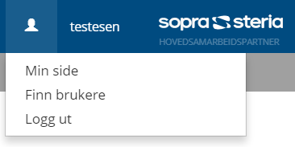
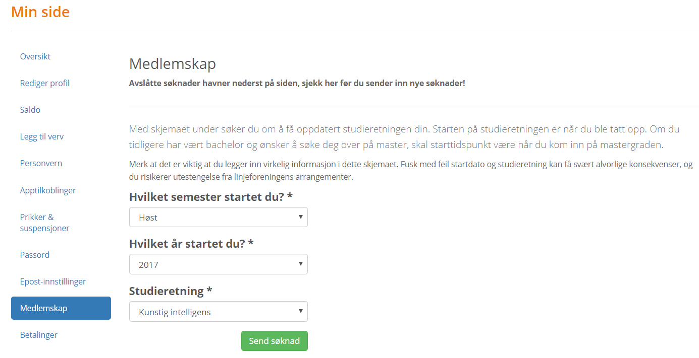

### Hvordan lage bruker og søke medlemskap

For å kunne melde deg på online sine arrangementer på du ha en bruker.

- Gå inn på https://online.ntnu.no/auth/register/ og fyll inn skjema. 
- Gå inn på mailen du får tilsendt og verifiser kontoen (husk å sjekke spam om du ikke finner mailen). 
- Gå inn på Min side som du finner ved å trykke på person-ikonet ved siden av brukernavnet ditt i headeren på nettsiden. 

I navigasjonsmenyen til venstre trykker du på Medlemskap. Her fyller du inn med din studieretning og sender inn søknad. 

Obs: du må ha lagt inn stud-mailen (som slutter på @stud.ntnu.no) i profilen for å kunne sende inn medlemssøknad.

Medlemssøknadene behandles manuelt, så de blir godkjent så fort noen i Hovedstyret har tid til å ordne det og har dokumentasjon på at du går på informatikk.

Nå er du klar til å melde seg på arrangementer i regi av Online!

Har du problemer? Send en mail til kontakt@online.ntnu.no så hjelper vi deg!