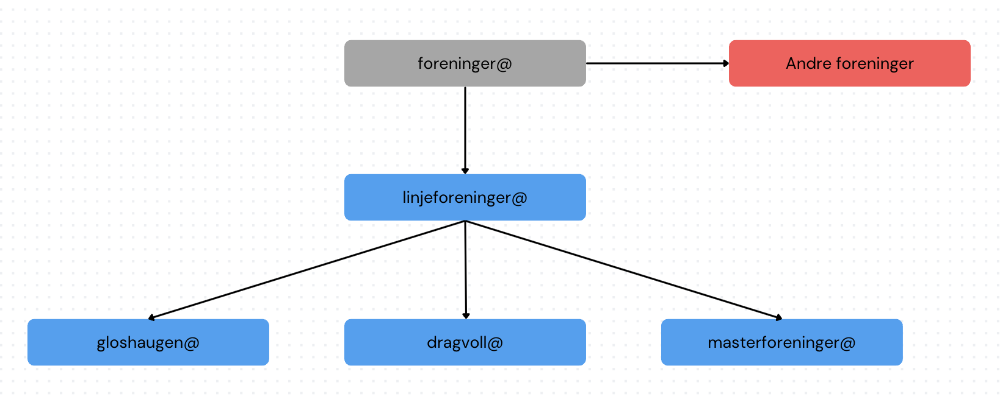

### Retningslinjer og oversikt

Epostlistene gjør det enkelt for linjeforeningene, og eksterne, å kontakte foreningene. Hensikten med disse epostlistene er å fremme kommunikasjon mellom foreningene og å skape en kanal for å kunne kontakte alle foreningene på en enkel måte.

Det er flere hundre brukere på epostlistene. Epost på listene må begrenses til informasjon som kommer fellesskapet til gode. Dette gjelder gjerne informasjon om hendelser og arrangementer som er interessant å informere om fordi det appellerer til studentmassen eller avgjørelser i de foreningsstyrene som mottar eposten.

Gode eksempler:

* Invitasjoner til jubileum, immatrikuleringsball, revy osv.
* Nyheter som påvirker linjeforeningene.
* Invitasjon til ikke-kommersielle foreningskurs.

Epost om jobbtilbud, reklame og annen avertering skal ikke sendes til disse listene. Epost uten noe relevant innhold for linjeforeningene som blir sendt til disse listene kan medføre advarsler, utestenging eller annen inndragelse av rettigheter. Vi (Online) ønsker ikke å sensurere meldinger, da det kan være vanskelig å bedømme hva andre synes er relevant. Vi ønsker heller ikke at blindkopi (BCC) skal benyttes, ettersom at vi ønsker å fremme åpenhet og muligheter for oppfølging. Vi ber derfor folk tenke seg nøye om før man bruker listene. Disse retningslinjene gjelder epostlistene på denne siden.

Følgende er en oversikt over epostlister som overlapper. Øverst har du foreninger-epostlisten som går til alle. Pass på så du ikke sender epost til overlappende lister da du risikerer at flere hundre personer får samme epost to ganger, da vil du oppleve å få frustrasjon rettet mot deg.

### List og medlemmer

import { Icon } from '@astrojs/starlight/components'

{(function() {

    const items = [
        {
            "name": "linjeforeninger",
            "members": [
                {"name": "Dragvoll", "email": "dragvoll@online.ntnu.no"},
                {"name": "Gløshaugen", "email": "gloshaugen@online.ntnu.no"},
                {"name": "Kalvskinnet", "email": "kalvskinnet@online.ntnu.no"},
            ],
        },
        {
            "name": "dragvoll",
            "members": [
                {"name": "Akwaaba", "email": "akwaabapost.ntnu@gmail.com"},
                {"name": "Apeiron", "email": "apeiron.ntnu@gmail.com"},
                {"name": "Babel", "email": "babel.linjeforening@gmail.com"},
                {"name": "CAF", "email": "cafidrett@gmail.com"},
                {"name": "Communitas", "email": "sosant.ntnu@gmail.com"},
                {"name": "De Folkevalgte", "email": "defolkevalgte@gmail.com"},
                {"name": "Dionysos", "email": "dionysoslinjeforening@gmail.com"},
                {"name": "Galleri af Klint", "email": "galleriafklint@gmail.com"},
                {"name": "Det Historiske Selskab", "email": "ntnu_dhs@hotmail.com"},
                {"name": "Erudio", "email": "styret@erudiontnu.no"},
                {"name": "Eureka", "email": "eurekalinjeforening@gmail.com"},
                {"name": "Fauréningen", "email": "faureningen@gmail.com"},
                {"name": "Gengangere", "email": "gengangerentnu@gmail.com"},
                {"name": "HF Studentrådet", "email": "hf@studentrad.no"},
                {"name": "Geolf", "email": "info.geolf@gmail.com"},
                {"name": "IVRig", "email": "ivrig.linjeforening@gmail.com"},
                {"name": "Jump Cut", "email": "jumpcut.dragvoll@gmail.com"},
                {"name": "Kultura", "email": "kulturalinjeforening@gmail.com"},
                {"name": "Leviathan", "email": "leviathan.ntnu@gmail.com"},
                {"name": "LiMP", "email": "linjeforeningenlimp@gmail.com"},
                {"name": "Lipton", "email": "liptonlinjeforening@gmail.com"},
                {"name": "Oda", "email": "oda.ntnu@gmail.com"},
                {"name": "Ordstyrer LF", "email": "ordstyrerhfsu@gmail.com"},
                {"name": "Paideia", "email": "paideiantnu@gmail.com"},
                {"name": "Panoptikon", "email": "offisielle.panoptikon@gmail.com"},
                {"name": "Primetime", "email": "primetime.ntnu@gmail.com"},
                {"name": "Psi", "email": "psi.linjeforening@gmail.com"},
                {"name": "Psykolosjen", "email": "psykolosjen@gmail.com"},
                {"name": "Socialis", "email": "socialis.lf@gmail.com"},
                {"name": "Socius Extremus", "email": "socius.extremus@hotmail.no"},
                {"name": "SU Studentrådet", "email": "su@studentrad.no"},
                {"name": "Teaterlosjen", "email": "hs@teaterlosjen.no"},
                {"name": "Theodor", "email": "theodor.arkeologi@gmail.com"},
                {"name": "TKS", "email": "tks.ntnu@gmail.com"},
                {"name": "YFF", "email": "yff.ntnu@hotmail.com"},
            ],
        },
        {
            "name": "gloshaugen",
            "members": [
                {"name": "Abakus", "email": "abakus@abakus.no"},
                {"name": "A/F Smørekoppen", "email": "styret@smorekoppen.no"},
                {"name": "Antidot", "email": "antidot.ntnu@gmail.com"},
                {
                    "name": "Arkitektstudentenes Broderskab",
                    "email": "kontakt@broderskabet.no",
                },
                {"name": "Bergstuderendes Forening", "email": "styret@bergstud.no"},
                {"name": "Delta", "email": "delta@delta.org.ntnu.no"},
                {"name": "Elektra", "email": "leder@elektra.io"},
                {"name": "Emil", "email": "styret@emilweb.no"},
                {"name": "Fraktur", "email": "fraktur.ntnu@gmail.com"},
                {"name": "FYSIO", "email": "trondheimfysio@gmail.com"},
                {"name": "HC", "email": "styret@hc.ntnu.no"},
                {"name": "H.M. Aarhønen", "email": "aarhonen-hs@list.stud.ntnu.no"},
                {"name": "Hybrida", "email": "styret@hybrida.no"},
                {"name": "Janus", "email": "janus@janus.org.ntnu.no"},
                {"name": "Leonardo", "email": "ilpresidente.leonardo@gmail.com"},
                {"name": "Logitas", "email": "styret@logitas.no"},
                {"name": "Mannhullet", "email": "styret@mannhullet.no"},
                {
                    "name": "MiT (ligger også på Kalvskinnet)",
                    "email": "leder@maskining.no",
                },
                {"name": "Nabla", "email": "nabla@nabla.ntnu.no"},
                {"name": "Nucleus", "email": "nucleuslinjeforening@gmail.com"},
                {"name": "Nutrix", "email": "post@nutrix.no"},
                {"name": "Omega", "email": "hs@omega.ntnu.no"},
                {"name": "Online", "email": "online@online.ntnu.no"},
                {"name": "Pareto", "email": "pareto.linjeforening@gmail.com"},
                {"name": "Placebo", "email": "placebo@list.stud.ntnu.no"},
                {"name": "Signifikant", "email": "signifikant-styret@org.ntnu.no"},
                {"name": "Solan", "email": "solan-leder@entreprenorskolen.no"},
                {"name": "Spanskrøret", "email": "styret@spanskroret.no"},
                {"name": "STØH", "email": "leder.stoh@gmail.com"},
                {"name": "TIHLDE", "email": "hs@tihlde.org"},
                {"name": "Timini", "email": "styret@timini.no"},
                {
                    "name": "Tim & Shænko (ligger også på Kalvskinnet)",
                    "email": "post@bygging.no",
                },
                {"name": "Vivas", "email": "leder@vivas.teknikersamfunn.no"},
                {"name": "Volvox & Alkymisten", "email": "styret@volvox.no"},
                {"name": "Ægir", "email": "styret@aegirntnu.no"},
            ],
        },
        {
            "name": "kalvskinnet",
            "members": [
                {"name": "Cibus", "email": "cibus.mattek@gmail.com"},
                {"name": "KOM", "email": "kom.linjeforening@gmail.com"},
                {
                    "name": "MiT (ligger også på Gløshaugen)",
                    "email": "leder@maskining.no",
                },
                {"name": "SALT", "email": "post@saltntnu.no"},
                {
                    "name": "Tim & Shænko (ligger også på Gløshaugen)",
                    "email": "styret@bygging.no",
                },
            ],
        },
        {
            "name": "kjellere",
            "members": [
                {"name": "Dragvollkjelleren", "email": "dragvollkjelleren@gmail.com"},
                {
                    "name": "Emil, Smørekoppen",
                    "email": "emil.smorekoppenkjelleren@gmail.com",
                },
                {"name": "Hybrida, Berg, Timini", "email": "kjellerkom@hybrida.no"},
                {"name": "Nabla, Janus, HC", "email": "kjellern.hk18@nabla.ntnu.no"},
                {
                    "name": "Dykkergruppa, NTNUI",
                    "email": "styret@dypet.dykkergruppa.no",
                },
                {"name": "Labamba", "email": "labamba@abakus.no"},
                {
                    "name": "Omega, Psykolosjen",
                    "email": "kjellersjefkielderen@gmail.com",
                },
                {
                    "name": "Realfagskjelleren",
                    "email": "realfagskjellern-styre@list.stud.ntnu.no",
                },
                {"name": "H.M. Aarhønen", "email": "krosjef@aarhonen.org.ntnu.no"},
            ],
        },
        {
            "name": "foreninger",
            "members": [
                {"name": "Linjeforeninger", "email": "linjeforeninger@online.ntnu.no"},
                {
                    "name": "Masterforeninger",
                    "email": "masterforeninger@online.ntnu.no",
                },
                {"name": "Badcom", "email": "badcom.mail@gmail.com"},
                {"name": "En Psykt Vanlig Uke", "email": "epvu.trondheim@gmail.com"},
                {"name": "Fadderutvalget", "email": "fadderutvalget@gmail.com"},
                {
                    "name": "Høyre studentforening",
                    "email": "hoyrestudenttrondheim@gmail.com",
                },
                {"name": "Taktlaus", "email": "styret@taktlaus.no"},
                {"name": "Mannskor", "email": "formann@mannskor.no"},
                {"name": "NTNUI", "email": "hovedstyret@ntnui.no"},
                {"name": "Radio Revolt", "email": "ntnu@radiorevolt.no"},
                {"name": "Revolve NTNU", "email": "post@revolve.no"},
                {"name": "Studenttinget", "email": "sti@studenttinget.no"},
                {"name": "Samfundet", "email": "styret@samfundet.no"},
                {"name": "Studentkor", "email": "leder@studentkor.no"},
                {"name": "Student-TV", "email": "styret@stv.no"},
                {"name": "Sukkerhuset", "email": "styret@sukkerhuset.no"},
                {"name": "Velferdstinget", "email": "vt@velferdstinget.no"},
                {"name": "Teknologiporten", "email": "post@teknologiporten.no"},
            ],
        },
        {
            "name": "masterforeninger",
            "members": [
                {"name": "Globus", "email": "globus.ntnu@gmail.com"},
                {"name": "Hippodamus", "email": "post@hippodamus.no"},
                {"name": "Njord", "email": "leder.njord@gmail.com"},
                {"name": "Oda", "email": "oda.ntnu@gmail.com"},
                {"name": "Pokayoke", "email": "pokayoke.ntnu@gmail.com"},
                {"name": "Projeksjon", "email": "kontakt@projeksjon.no"},
                {"name": "ProMan", "email": "promanntnu@gmail.com"},
                {"name": "Solan", "email": "solan-leder@entreprenorskolen.no"},
                {"name": "Soma", "email": "soma@list.stud.ntnu.no"},
                {"name": "Symbiosis", "email": "symbiosis.board@gmail.com"},
            ],
        },
        {
            "name": "sr-samarbeid",
            "members": [
                {"name": "Delta", "email": "delta@delta.org.ntnu.no"},
                {"name": "Abakus", "email": "hs@abakus.no"},
                {"name": "Omega", "email": "hs@omega.ntnu.no"},
                {"name": "Online", "email": "hovedstyret@online.ntnu.no"},
                {"name": "Nabla", "email": "nabla@nabla.ntnu.no"},
                {
                    "name": "Studentrådet IME",
                    "email": "studentrad_ime-medlem@org.ntnu.no",
                },
                {"name": "Spanskrøret", "email": "styre@spanskroret.no"},
                {"name": "Elektra", "email": "styret@elektra.io"},
                {"name": "Emil", "email": "styret@emilweb.no"},
                {"name": "Epsilon", "email": "epsilon.linjeforening@gmail.com"},
                {"name": "TIHLDE", "email": "hs@tihlde.org"},
                {"name": "INGa", "email": "inga@hig.no"},
                {"name": "Login", "email": "login@gjovik.ntnu.no"},
            ],
        },
        {
            "name": "iv-samarbeid",
            "members": [
                {"name": "H.M. Aarhønen", "email": "hs@aarhonen.no"},
                {"name": "Hybrida", "email": "hybrida@org.ntnu.no"},
                {"name": "Studentrådet IV", "email": "medlem@sr-iv.no"},
                {"name": "Teknologiporten", "email": "post@teknologiporten.no"},
                {"name": "A/F Smørekoppen", "email": "styret@smorekoppen.no"},
                {"name": "Bergstuderendes Forening", "email": "styret@bergstud.no"},
                {"name": "Emil", "email": "styret@emilweb.no"},
                {"name": "Mannhullet", "email": "styret@mannhullet.no"},
            ],
        },
        {
            "name": "linjeledere",
            "members": [
                {"name": "Abakus", "email": "leder@abakus.no"},
                {"name": "A/F Smørekoppen", "email": "phormand@smorekoppen.no"},
                {
                    "name": "Arkitektstudentenes Broderskab",
                    "email": "dominus@broderskabet.no",
                },
                {"name": "Bakbenken", "email": "bakbenken@online.ntnu.no"},
                {"name": "Bergstuderendes Forening", "email": "leder@bergstud.no"},
                {"name": "Delta", "email": "delta.leder@gmail.com"},
                {"name": "Elektra", "email": "leder@elektra.io"},
                {"name": "Emil", "email": "leder@emilweb.no"},
                {"name": "FYSIO", "email": "trondheimfysio@gmail.com"},
                {"name": "Globus", "email": "president@globusntnu.no"},
                {"name": "HC", "email": "phormand@hc.ntnu.no"},
                {"name": "Helix", "email": "helix.leder@gmail.com"},
                {
                    "name": "H.M. Aarhønen",
                    "email": "aarhonen-kanzler@list.stud.ntnu.no",
                },
                {"name": "Hybrida", "email": "leder@hybrida.no"},
                {"name": "Janus", "email": "janus-president@org.ntnu.no"},
                {"name": "KOM", "email": "leder.kom.linjeforening@gmail.com"},
                {"name": "Leonardo", "email": "ilpresidente.leonardo@gmail.com"},
                {"name": "Mannhullet", "email": "formann@mannhullet.no"},
                {"name": "Nabla", "email": "leder@nabla.ntnu.no"},
                {"name": "Nucleus", "email": "nucleus.leder@gmail.com"},
                {"name": "Nutrix", "email": "leder@nutrix.no"},
                {"name": "Omega", "email": "stormeister@omega.ntnu.no"},
                {"name": "Online", "email": "leder@online.ntnu.no"},
                {"name": "Pareto", "email": "pareto.leder@gmail.com"},
                {"name": "Placebo", "email": "leder@mfplacebo.no"},
                {"name": "Salt", "email": "leder@saltntnu.no"},
                {"name": "Solan", "email": "leder@solanlinjeforening.no"},
                {"name": "Spanskrøret", "email": "rektor@spanskroret.no"},
                {"name": "Studenttinget", "email": "sti@studenttinget.no"},
                {"name": "Studenttinget", "email": "styrerep@studenttinget.no"},
                {"name": "Støh", "email": "leder.stoh@gmail.com"},
                {"name": "Tihlde", "email": "president@tihlde.org"},
                {"name": "Tim & Shænko", "email": "leder@bygging.no"},
                {"name": "Timini", "email": "buckminister@timini.no"},
                {"name": "Vivas", "email": "leder@vivasntnu.no"},
                {"name": "Volvox & Alkymisten", "email": "leder@volvox.no"},
                {"name": "Ægir", "email": "styreleder@aegirntnu.no"},
            ],
        },
        {
            "name": "linjeledere-oya",
            "members": [
                {"name": "Baris", "email": "leder.baris@gmail.com"},
                {"name": "Viventibus", "email": "viventibus@gmail.com"},
                {"name": "Placebo", "email": "leder@mfplacebo.no"},
                {"name": "Nutrix", "email": "leder@nutrix.no"},
                {"name": "SoMa", "email": "somaevent@gmail.com"},
                {"name": "Antidot", "email": "antidot.ntnu@gmail.com"},
                {"name": "Socialis", "email": "socialis.lf@gmail.com"},
                {"name": "Fraktur", "email": "fraktur.ntnu@gmail.com"},
                {"name": "Helix", "email": "helix.leder@gmail.com"},
                {"name": "Ergo", "email": "ergoledertrondheim@outlook.com"},
                {"name": "CAF", "email": "cafidrett@gmail.com"},
                {"name": "Nucleus", "email": "nucleus.leder@gmail.com"},
                {"name": "Fysio", "email": "trondheimfysio@gmail.com"},
            ],
        },
        {
            "name": "glosfaddere",
            "members": [
                {"name": "H.M. Aarhønen", "email": "aarhonen-skogvokter@list.ntnu.no"},
                {"name": "Timini", "email": "ansvarsminister@timini.no"},
                {
                    "name": "Bergstuderendes Forening",
                    "email": "bsf-fadderkom@org.ntnu.no",
                },
                {"name": "Emil", "email": "fadderansvarlig@emilweb.no"},
                {"name": "HC", "email": "fadderkom@hc.ntnu.no"},
                {"name": "Hybrida", "email": "faddersjef@hybrida.no"},
                {"name": "Omega", "email": "faddersjef@omega.ntnu.no"},
                {"name": "Spansrøret", "email": "faddersjef@spanskroret.no"},
                {"name": "Janus", "email": "janus-president@org.ntnu.no"},
                {"name": "Leonardo", "email": "leonardo-forstemann@list.stud.ntnu.no"},
                {"name": "A/F Smørekoppen", "email": "phaddercom@smorekoppen.no"},
                {"name": "Placebo", "email": "placebo-faddersjef@list.stud.ntnu.no"},
                {"name": "Nabla", "email": "sekretaer@nabla.ntnu.no"},
                {"name": "Online", "email": "velkom@online.ntnu.no"},
                {"name": "Volvox & Alkymisten", "email": "volvox-fadder@list.ntnu.no"},
            ],
        },
    ];
    return items.map(list => {
        return (
        

        

            <a href={`mailto:${list.name}@online.ntnu.no`}>{`${list.name}@online.ntnu.no`}</a>
        

        <ul>
        {
            list.members.map(org => (<li><a href={`mailto:${org.email}`}>{org.name}</a></li>))
        }
        </ul>
        
)
    })
})()}

Utdatert info? Send endringsforslag ved å trykke på "Rediger side" under, eller send en e-post til dotkom@online.ntnu.no.
