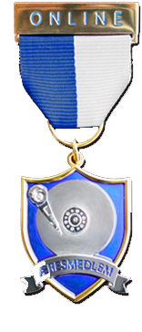
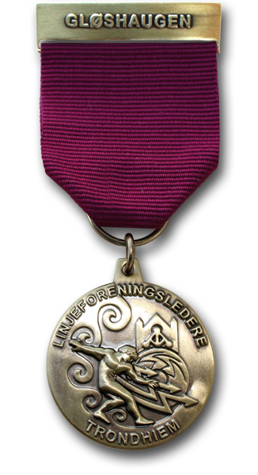

Online har de siste årene begynt å få en del forskjellige daljer. Dette er en oversikt over disse.

Den første Komitédaljen er gratis, etter det koster den 100,-.
Alle får en gratis pin etter fullført kompilering, etter det koster pinen 40,-.
Hvis du har mistet pin eller dalje betales dette til HS-konto, 1644.20.38094, og merkes med navn. Så kan du kontakte noen i HS, så finner de en ny til deg.

Æresmedlemsdaljen
=================

    Æresdaljen i all sin prakt
Æresmedlemsdaljen er utvilsomt den daljen i Online som henger høyest. Æresmedlemsdaljen er kun produsert i ti eksemplarer og er per nå utdelt tre ganger. Daljen dels utelukkende ut på ekstra flotte arrangementer. De stolte bærere av Onlines æresdalje er:

* Arvid Holme
* Steinar Hagen
* Erlend Klakegg Bergheim

Medaljen ble introdusert i 2010 og er designet av Magnus Line, tidligere leder av proKom. Den er produsert av [Musette](http://www.musette.no). Daljen er [showcaset](http://musette.no/no/produkter/medaljer/eksempler/) på deres nettsider og der kan man lese at:
> Medaljen er en avansert variant i 3D-teknikk, laget i blankt gull belagt med sølv på motivet og banneret. Den blå bakgrunnen er laget i perlemor-effekt for å skape mer dybde i fargen.

HS-daljen
==================

    Hovedstyredaljen
HS-daljen deles ut til Onlines hovedstyre ved endt generalforsamling og er et symbol på den tilliten hovedstyret blir vist av Onlines medlemer. Daljen er produsert av [Trofé AS](http://www.trofe.no/) og viser et lyn gjennom en sirkel på en blå og hvit bakgrunn. Designer ukjent.

Gammel HS-dalje
==================

    Gammel HS-dalje.
Slik så hovedstyrets dalje ut før. Lite er visst om denne, men det anntas at det er Trofé som står for produksjonen. Daljen er veldig enkel, med "STYRET" og "ONLINE" satt i en sirkel, med krans rundt. Bæres i dag av ytterst få, og er et sjeldent syn.

Linjeleder-dalje
==================

    Linjeleder-dalje.
Linjeleder-daljen utdeles til den nye lederen av Online under Generalforsamlingen. Daljen er produsert av [Musette](musette.no) og viser NTH-logoen som tegnet av Kristiania-maleren Domenico Erdman i 1912. Daljen har guden Prometevs som motiv.

Lang og tro tjeneste
==================

    Lang og tro tjeneste
Denne daljen deles ut for lang og tro tjeneste i Onlines komitéer eller Realfagkjelleren, og symboliserer et utall frivillige timer nedlagt i Online sitt virke. Opprinnelig skal daljen deles ut etter tre år, men deles i dag ut ved påbegynt tredje år. Den deles typisk ut ved festelige anledninger som immatrikuleringsball og julebord. Daljen er produsert av Trofé og viser to hender i et håndtrykk, og er et generisk design fra produsenten.

Komitédaljer
==================

    Komitedaljer
Komitédaljene ble introdusert i 2011 og tok over for komitépinsen for å markere komitémedlemer. Daljene er baserte på komitésymbolene utviklet av Magnus Line og resten av prokom. Komitédaljen deles ut til komitémedlemer mot slutten av første semester med arbeid, ofte i sammenheng med julebordet. Produsert av Trofé.

Backlog, Nodekomité, Kompileringsdalje
==================
[IMAGE]
    Bilder
[DESCRIPTION]

Onlines 25års-dalje
==================

    Online 25 år!
Delt ut til deltagere på Onlines 25-årsjubileum, 12. november 2011. Daljen er en utstanset utgave av jubileumslogoen, designet av tidligere prokom-medlem Beate Hay. Logoen er en spesialutgave av den vanlige O-logoen til Online, og er pyntet med et lite bånd med "25" skrevet i binært. Daljen var på den tiden en av de første på Gløshaugen som var utstanset og ikke bare preget på en bakgrunn, og skilte seg med dette ut. Også produsert av Trofé.

Onlines 30års-dalje
==================

Til Onlines 30-årsjubileum ble det selvsagt designet dalje. Designer var Carl Erik Friedemann. Daljen er jubileumslogen, en sirkuler variant av Online-O-en med lynet gjennom. Medaljen er i blankt gullpreg, med blå emalje i O-en. Medaljen henger i et blått, oransje og hvitt bånd, og skiller seg med dette fra de øvrige onlinedaljene som kun har blå og hvite bånd. Agraffen er preget med 00011110. Medaljen ble produsert av Musette.

Redaktørdaljen
==================

    Daljen til Offlines redaktør
Redaktør av Offline, linjeforeningens tidsskrift, bærer denne daljen. Daljen utdeles sammen med redaktørhatten på immball eller andre passende anledninger. Daljen viser Offlines logo, designet av tidligere prokom-medlem Beate Hay. Medaljen er produsert med en lasergravert plate satt i en krans. Produsert av Trofé.

Pins
==================
Gammel komitépin
------------------

    Gammel komitépin
Før Online innførte komitédaljer ble komitépinen brukt for å markere komitémedlemmer. Pinen er sirkulær, med en blå og en hvit halvdel. Den blå delen skal være på venstre side, slik som på daljebåndene.

Kompileringspin
------------------

    Kompileringspin
Alle kompilerte medlemmer av Online mottar sin kompileringspin fra Eldsterådet. Pinen viser Online sin O-logo.