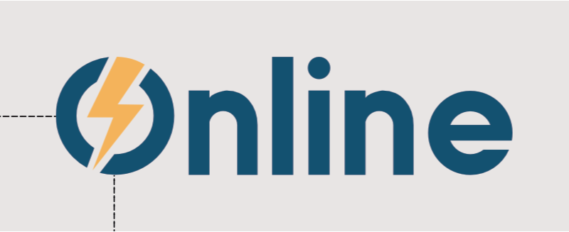
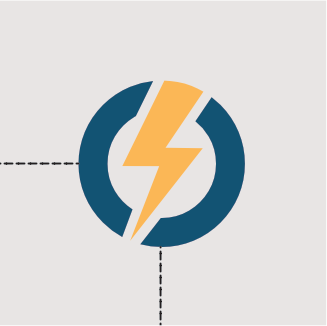
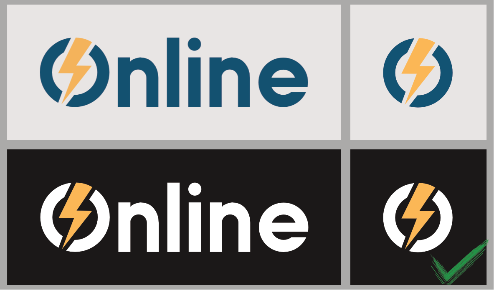
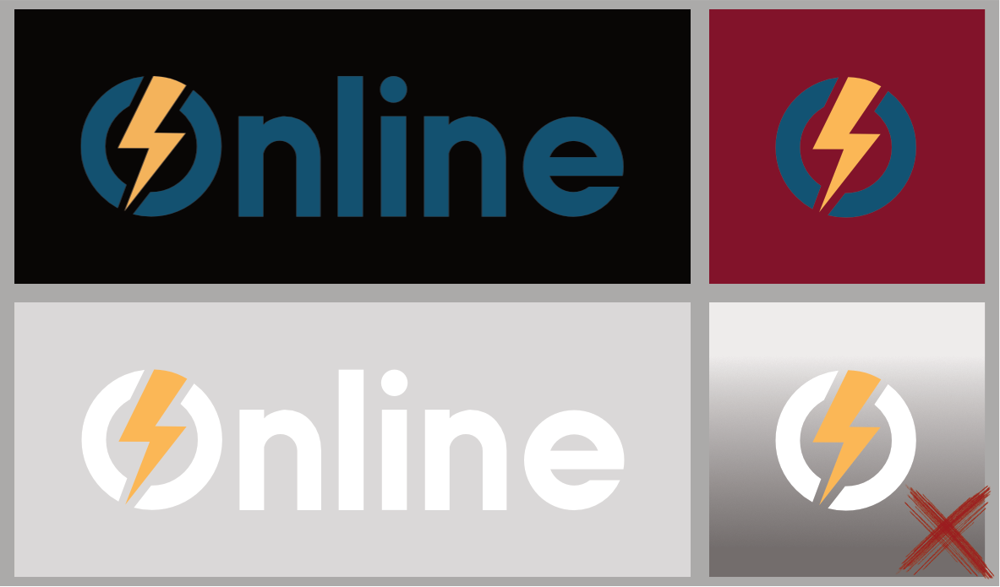

# Merkevare

For at Online skal kunne fremme seg som en seriøs linjeforening med hensikt om å ta vare på sine studenter, gjelder det at organisasjonen gjenspeiler samme konsistens og profesjonalitet under sin egen profilering. Da bygges opp en uvurderlig merkevare som oppfattes daglig av Onlines medlemmer, NTNU, bedrifter og andre eksterne kontakter. Dette oppnås ved at alle synlige aspekter ved linjeforeningen er lett gjenkjennbare, tydelige i utforming og ellers pene å se på. De blå og oransje fargene skal brukes der det er hensiktsmessig og logoen skal komme tydelig frem både på trykk, nettsidene våre og andre sosiale medier. Om Online klarer å følge disse prinsippene i sin helhet, vil organisasjonen oppfattes som en profesjonell linjeforening med sterk tilstedeværelse.

# Logo og logobruk

Logoen til Online er sterkt gjenkjennbar med sin blå farge og oransje lyn. Ikke bare finnes det en logo som staver ut ordet "Online", men det eksisterer også et eget "ikon" - en O - som ved enkelte anledninger kan benyttes på egen hånd. Det kan derfor noen ganger være vanskelig å vite når man skal bruke logoen, og hvilken type logo man skal bruke.

Onlinelogoen skal brukes i tilfeller hvor linjeforeningen som organisasjon har behov å identifisere seg selv og for å bygge opp sin merkevare. I kommunikasjon med bedrifter og aktører som linjeforeningen handler med, skal logoen brukes slik at Online skiller seg ut og enkelt kan identifiseres. Da er det gjerne naturlig at logoen brukes sammen med profilering fra andre samarbeidspartnere, på for eksempel trykkmateriale som t-skjorter, flyers og plakater. Logoen skal dessuten alltid være synlig på nettsidene våre, i for eksempel header og/eller footer.

Ikonet til Online brukes i sammenhenger hvor det er tydelig hva det hører til og kan "forkorte" hovedlogoen. Hvis ikonet brukes profesjonelt mot eksterne aktører, skal man aldri være usikker på om ikonet tilhører Online linjeforening. Da må konteksten være riktig. Ikonet kan derfor ikke _erstatte_ logoen, men heller tilføye valgfrihet i profileringen av Onlines merkevare. For eksempel vil det være naturlig å bruke ikonet som profilbilde på sosiale medier, da man gjerne ser navnet på linjeforeningen ved siden av bildet. Ikonet kan også benyttes som del av merch på stickers, gensere, og lignende.

# Logohåndtering

Profil- og aviskomiteen har hovedansvar for design av trykkmateriale og profilering, og lager derfor mesteparten av Onlines profilmateriale selv. Derfor er det foretrukket at større prosjekter som involverer design går gjennom prokom, enten som bestilling eller for veiledningens skyld. Andre linjeforeninger og bedrifter har derimot kanskje behov for å bruke Onlinelogoen selv. Om man ønsker eller har behov for å lage design på egen hånd, finnes det retningslinjer for logohåndtering under.

## Plassering av logo

Hovedreglene for plassering av logo er beskrevet under samt illustrert på de vedlagte bildene.

### Luft

Logoen skal alltid ha nok luft rundt seg. Det betyr at den ikke skal stå for nærme andre grafiske elementer slik at den sliter med å skille seg ut. Om logoen står i et hjørne, skal den alltid ha luft under og ved siden av tilsvarende _minst halve_ diameteren til O'en i logoen. Se bildet for demonstrasjon.

Logoplassering for bruk av hele logoen

Ikonplassering for bruk av ikon

### Andre grafiske elementer og logoer

Prinsippene om luft gjelder også for sambruk av andre logoer. Pass på at logoene ikke står for tett på hverandre og respekter andre organisasjoners retningslinjer for bruk av logo.

### Proporsjoner

Logoens proporsjoner skal alltid bevares. Det vil si at den ikke skal strekkes ut eller presses sammen, slik at den alltid ser lik ut hvor enn den brukes.

### Oppløsning

Om logoen må gjøres stor, pass på at oppløsningen er god nok til at kantene forblir skarpe. Bruk .svg-versjonen (vektor) ved behov.

## Endringer på logo

Stilisering av logoen, dvs. endringer på designet for spesifikke formål, er tillatt under visse betingelser. Endringen skal ha et spesifikt formål som tilføyer ny mening til bruken av logoen. Hvis logoen skal endres, må det gjøres på en større skala og i samsvar med et tema eller en stil slik at det tydelig kommer frem _hvorfor_ den er endret. Endringer må gjøres respektfullt og følge øvrige retningslinjer på design, slik at man tydelig ser at dette er en stilisert versjon av logoen. Designet skal også stå i samsvar med Onlines kvalitet. Det er _ikke_ tillatt å gjøre mindre uhensiktsmessige endringer som å bytte farger, legge på skygge, småendre på utforming, flytte lynet, delvis dekke logoen, osv.

# Fargebruk

Lovlig bruk av bakgrunnsfarger bak logo

Ulovlig bruk av bakgrunnsfarger bak logo

## Bakgrunnsfarger

Logoen alene er ikke det eneste som påvirker hvordan Online oppfattes. Fargevalg på både trykkmateriale og digital produksjon er viktig for at helheten skal komme tydelig frem. Først og fremst må logoen ha riktig kontrast mot bakgrunnen. Den blå logoen skal brukes mot hvit eller veldig lys bakgrunn. Er bakgrunnen svart, farget eller mørkegrå, skal den hvite benyttes. Kontrasten må være god nok over hele bakgrunnen, så her må det brukes skjønn. Vær også varsom på gradient bak logoen om kontrasten ikke er god hele veien. Bildene illustrerer hvordan logoen kan brukes.

## Onlines fargeprofil

Onlinelogoens offisielle fargeprofil finner du i tabellen under. Logoen bruker CMYK på fysisk trykk og RGB digitalt, dvs. på nettsider.

|    Type     |      Blå       |     Oransje     |
| :---------: | :------------: | :-------------: |
|    CMYK     | 93, 58, 34, 21 |  0, 34, 71, 0   |
|  RGB (Hex)  |    #0D5474     |     #F9B759     |
| Pantone PMS | PANTONE 308 CP | PANTONE 1365 CP |

I tillegg kan det være ønskelig å bruke andre nyanser av blå og oransje på f\.eks. nettsider eller annet design. Blå brukes da hovedsaklig som primærfarge, mens oransje brukes sekundært. Pass også på at kontrastene mellom nyansene er gode nok. For å se en oversikt over hvilke kontraster og paletter som brukes av Onlines nettsider, kan du ta en titt på [Onlines designsystem](https://storybook.online.ntnu.no/?path=/docs/global-colors--primary).

# Vedlegg

Om man har behov for å bruke Onlines logoer, ikoner og symboler, kan man laste ned kits og enkeltstående bilder nedenfor.

## Kits

### [Logokit](/attachments/677-Logokit.zip) - Inneholder alle logoversjoner på .png og .svg-format

## PNG - enkeltbilder

### [Blå](/attachments/679-Online_bla.png) - logo

### [Blå](/attachments/680-Online_bla_o.png) - ikon

### [Hvit](/attachments/681-Online_hvit.png) - logo

### [Hvit](/attachments/682-Online_hvit_o.png) - ikon

## SVG - enkeltbilder

(Kommer når OW støtter nedlasting av .svg-filer. Alt ligger i logokit.)

### Blå\* - logo

### Blå\* - ikon

### Hvit\* - logo

### Hvit\* - ikon

## Annet

### [Komitésymboler](/attachments/678-Komitésymboler.zip) - Inneholder alle komitésymboler på .eps- og png-format

## Presentasjonsmal

Online har også en relativt enkel presentasjonsmal som kan brukes når noen i linjeforeningen skal holde en presentasjon internt eller til eksterne. Denne kan du finne på Drive, i form av Google Presentation og PowerPoint. Hvis du vil bruke den som Theme i Google Drive, kan du følge disse stegene:

- Legg til malen i din egen Drive
- Opprett ny presentasjon
- Gå til 'Themes'
- Trykk på 'Import Themes'
- Velg presentasjonsmalen som Theme

[Klikk her for å se begge versjonene og for nedlasting](https://drive.google.com/drive/folders/1KqW6iIgtJVHzGW9jis0J_rgGx-Tkkb-1?usp=sharing). Si ifra om du gjerne skulle ha lagt til eller endret noe på malen!

# Henvendelser

Spørsmål og henvendelser kan sendes til [profil- og aviskomiteen på mail](mailto:prokom@online.ntnu.no). Vi tar gjerne imot ris og ros, samt forslag til forbedringer!
