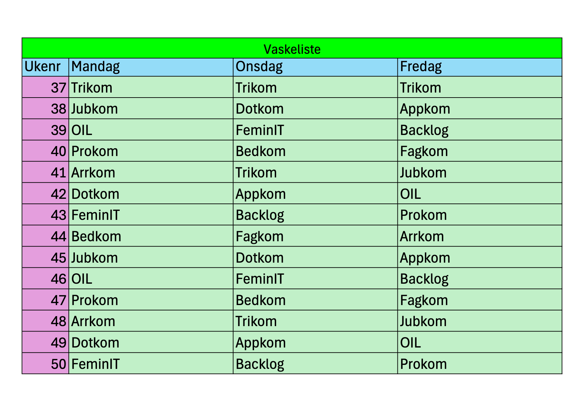
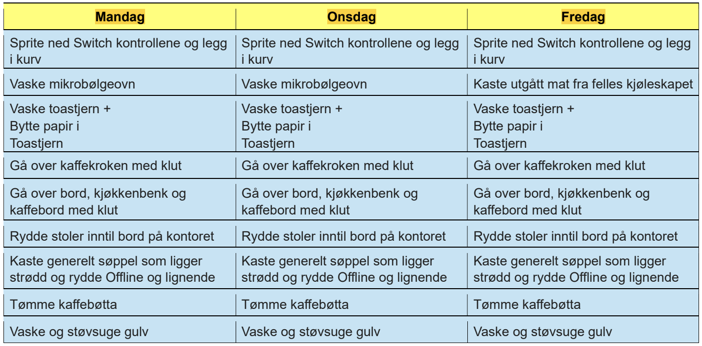

## Hva er det?

Alle aktive komiteer under Online Linjeforening deler på ansvaret av å vaske kontoret. Kontoret vaskes tre (3) ganger i uken; på mandag, onsdag, og fredag. Hvilken komité som vasker kontoret hvilken dag og uke, samt vaskeoppgaver, sendes på mail fra trikom sin kontorordningansvarlig. Det er opp til komiteene hvem og hvor mange som skal vaske, men normalt sett er man to som vasker sammen. Ved fullført vask skal man signere på listen som henger på kjøleskapet på kontoret før klokken 16 dagen man vasker, hvis ikke anses vasken som underkjent.

## Regler og straffer

- Trikom sin kontorordningansvarlig kontrollerer at vasken er gjennomført og godkjent
- Om det ikke er skrevet opp på listen innen kl. 16 så skal det føres en straff på personene som var ansvarlig internt i gjeldende komite.
    - I tillegg til straff, skal ansvarlige vaske kontoret så fort som mulig. Dette for at man ikke skal kunne "kjøpe seg ut av" kontorvask, og for at det ikke skal gå ut over de neste som skal vaske kontoret.
    - Dersom komitélederen ikke har satt opp hvem som skal gjøre arbeidet er det den som må ta straffen.
    - En straff er her en vinstraff til en verdi av 100kr.
- Dersom noen har ført opp at de har gjort oppgavene, men det tydelig ikke har blitt gjort skal dette dokumenteres med bilder, og straffen vil bli doblet.
    - Ved straff man mener er feil kan dette klages på. Da kan det sendes inn mail til [trikom@online.ntnu.no](mailto:trikom@online.ntnu.no) med dokumentasjon på at det har blitt gjort.
- Dersom oppgavene er gjennomført, men det er ikke blitt skrevet opp vil det bli ført straff, men denne kan fjernes ved klage med dokumentasjon.

## Vaskelisten

Dette er et eksempel på hvordan vaskelisten ser ut. Merk at ukenummer, og hvilke komiteer som vasker varier hvert semester. Oppdatert vaskeliste er sendt på mail til de det gjelder.

## Vaskeoppgaver

Dette er et vaskeoppgavene per **27.10.2025**. Merk at vaskeoppgavene kan være oppdatert siden dette. Oppdaterte vaskeoppgaver er sendt på mail til de det gjelder.

