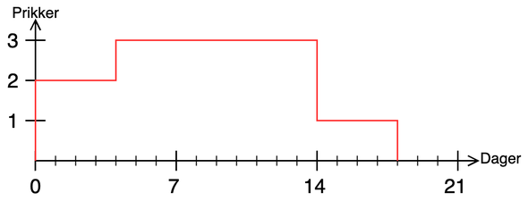

## **Hva er en prikk?**

Prikker er et straffetiltak for å sikre at medlemmene av Online følger reglene. Det at du har aktive prikker innebærer at du vil måtte vente en viss periode etter ordinær påmeldingsstart for å melde deg på et arrangement. **Hver prikk varer i 14 dager fra tidspunktet du får den**.

| Totalt antall prikker | Utsatt påmelding                              |
|-----------------------|-----------------------------------------------|
| 1 prikk               | 1t                                            |
| 2 prikker             | 4t                                            |
| 3 prikker             | 24t                                           |
| 6+ prikker            | Suspensasjon i 14 dager fra siste prikk       |

Prikker er overlappende. Dette betyr at dersom du får nye prikker når du allerede har aktive prikker fra en annen anledning, så vil disse prikkene plusses sammen. Hver anledning som har gitt deg prikker vil ha sin egen levetid før de ikke er aktive lenger.

Eksempel

Du får 2 prikker for å melde deg av et arrangement sent. Nå har du fire timers utsettelse på alle påmeldinger. Fire dager senere får du to nye prikker for å ikke ha sendt inn tilbakemeldingsskjema innen tidsfristen. Nå vil du i ti dager fremover ha totalt 4 aktive prikker og dermed ha 24 timers utsettelse på alle påmeldinger. Etter disse ti dagene vil de to første prikkene løpe ut og du vil da kun ha to aktive prikker i fire dager. Dette medfører fire timers utsettelse på påmeldinger.

Eksempelet visualisert:

 

Ferier

Varigheten til prikker er fryst i ferier. Disse er definert fra 5. desember til 10. januar og 1. juni til 15. august. Dersom en prikk gis 24. mai vil altså denne prikken utløpe 20. august.

## **Hva gir prikker?**

Dette er en kort punktliste. Unntak og videre forklaringer finner du lenger ned.
- Å melde seg av etter avmeldingsfristen inntil 2 timer før arrangementstart gir 2 prikker, etter dette gis det 3 prikker.
- Å ikke møte opp på et arrangement man har plass på gir 3 prikker.
- Å møte opp etter arrangementets start eller innslipp er ferdig gir i utgangspunktet 3 prikker. Her vil en skjønnsmessig vurdering bli foretatt ut fra hvor sent deltakeren ankom arrangementet.
- Å ikke svare på tilbakemeldingsskjema innen tidsfristen gir 2 prikker.
- Å ikke overholde betalingsfristen gir 1 prikk. Dette medfører i tillegg suspensjon fra alle Onlines arrangementer inntil betaling er gjennomført.

Den ansvarlige komiteen kan også foreta en skjønnsmessig vurdering som gagner deltakeren.

## **Avmelding**

- Ved sykdom eller andre ekstraordinære hendelser vil man ikke få prikk ved avmelding 5 timer før arrangementsstart. Etter dette gis prikker som normalt iht. punktene over.
- Alle komiteer ønsker at du melder deg av arrangementer selv om du vet dette vil medføre prikker. Dette er slik at noen andre kan bli obs på plassen sin så tidlig som mulig.

## **Venteliste**

- Hvis du står på venteliste kan du melde deg av helt til arrangementet starter.
- Når du står på venteliste er du inneforstått med at du når som helst kan få plass på arrangementet og dermed er bundet til reglene for arrangementet på lik linje med andre påmeldte.

## **Betaling**

- Ved manglende betaling suspenderes man fra alle Onlines arrangementer inntil betalingen er gjennomført.
- Ved betalt arrangement, men manglende oppmøte, vil man ikke få tilbakebetalt dersom avmelding skjer etter frist. Dersom neste på venteliste er tilgjengelig kan dette gjøres unntak for.

## **Oppførsel**

- Ved upassende oppførsel under et av Onlines arrangement vil du stå økonomisk ansvarlig for eventuelle skader, og i verste fall risikere utestengelse fra alle Onlines arrangement.

## **Bedriftsarrangementer**

- Ved bedriftsarrangementer åpner dørene i henhold til starttid på arrangementet. Ti minutter etter at dørene åpner slippes oppmøte på ventelisten inn dersom det er plass. 15 minutter etter at dørene åpner stenger innslippet.
- Det kreves at en deltaker svarer på den elektroniske tilbakemeldingen etter bedriftsarrangementer. Det vil komme e-post etter arrangementet med lenke til tilbakemeldingsskjema som må besvares innen den oppgitte fristen. Dersom en deltaker ikke svarer innen fristen, vil dette gi to prikker.
- Deltakere på bedriftsarrangementer skal delta på alle obligatoriske deler av arrangementet. For bedriftspresentasjon og kurs vil dette henholdsvis innebære selve presentasjonen og kursopplegget. De første 45 minuttene med påfølgende mingling regnes også som obligatorisk . Dersom en deltaker forlater den obligatoriske delen uten gyldig grunn vil dette medføre 2 prikker.

## **Hvorfor har jeg fått prikk?**

Under “Profil” (https://online.ntnu.no/profil) vil du kunne se prikkene dine, og eventuelle begrunnelser.

Dersom du mener noe feil har skjedd, vennligst ta kontakt med arrangøren som står oppført på arrangementet. Kontaktinfo for arrangerende komité vises på arrangementssiden.
