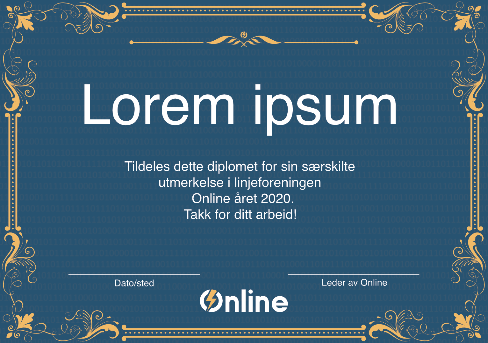

Særskilt utmerkelse er en av de gjeveste prisene som deles ut hvert år i Online. Prisen deles gjerne ut til et fåtall personer som det siste året har gjort et utmerket arbeid for Online, som regel utover egen rolles forventning i linjeforeningen.

Utmerkelsen gis ut på julebord da denne prisen skal være litt ekstra fin å få. Den har tidligere blitt gitt ut på generalforsamling.

# Diplom for Særskilt utmerkelse (fra og med 2020)

# Gammel diplom for Særskilt utmerkelse (til og med 2019)

